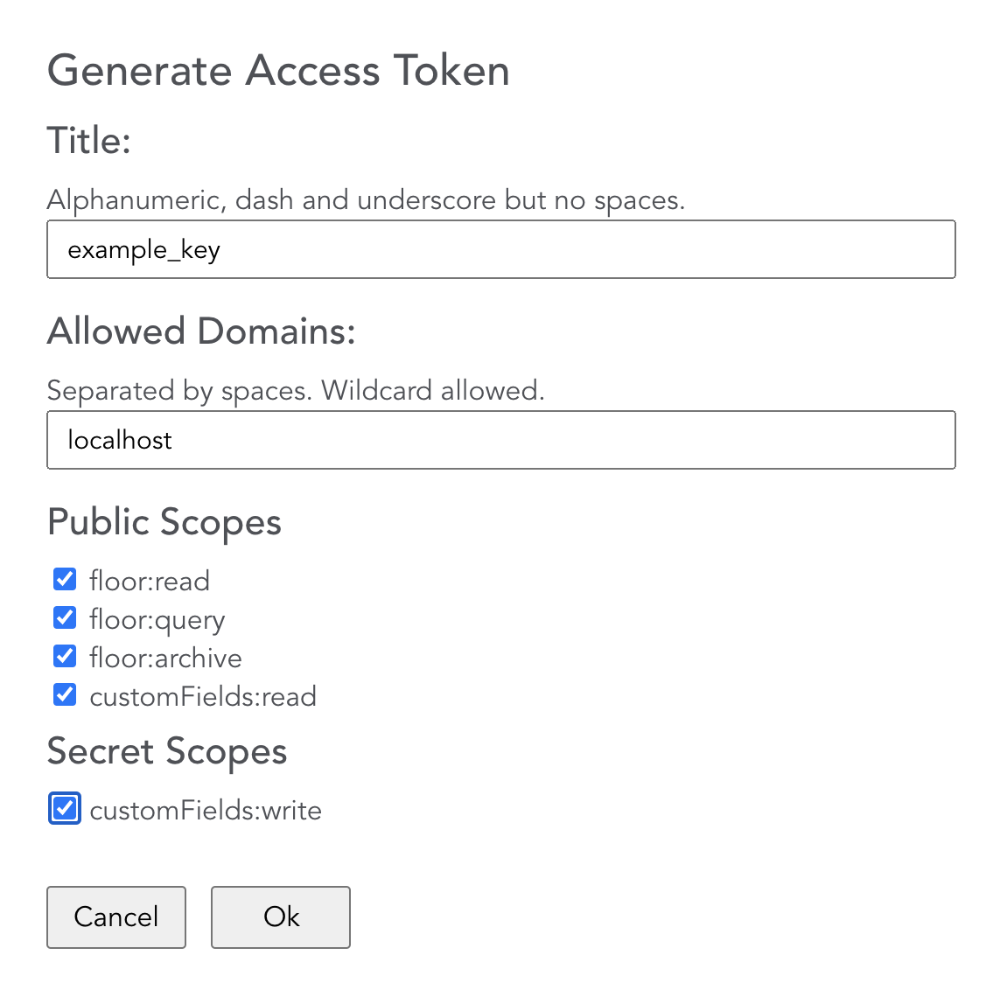
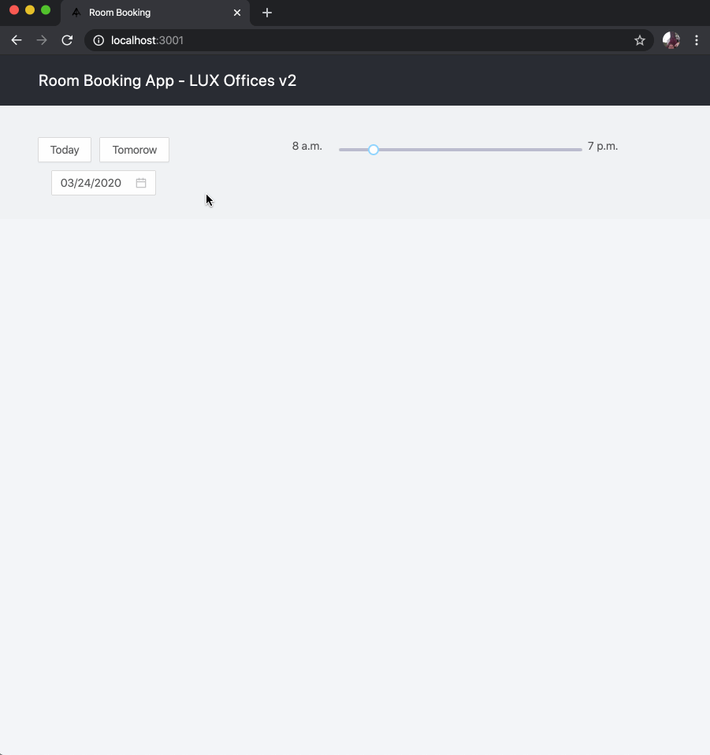

# Archilogic Room Booking App Example

This is a simple prototype of a room booking app for managing room booking in a given space.

Check out a [Demo](https://archilogic-room-booking.herokuapp.com)

## Setup local server 

Navigate to the server folder and run:

    yarn install

The server needs a secret token to negotiate a temporary token.

https://developers.archilogic.com/space-api/v2/introduction.html#secret-access-token

Create a new secret token and add it to the ARCHILOGIC_SECRET_KEY environment variable.

then run:

    node server.js

## Install and Run 

In the project directory, you can run:

	npm install

This command will install all the dependencies needed for the project to run locally.

To run the app we'll need to set some environment variables first.  
You'll need an API key [https://developers.archilogic.com/api-keys.html](https://developers.archilogic.com/api-keys.html).  



Once you have these keys, please create a .env file  (you can copy it from .env.example) and fill in the values for 

	cp .env.example .env
	 	
Update .env variables:

	REACT_APP_PUBLISHABLE_TOKEN=YOUR_TOKEN
	REACT_APP_ARCHILOGIC_API_URL=https://api.archilogic.com

To run the application execute:

	npm start

The project loads a default scene but you can change it by a different one by specifing `?sceneId=THIS_IS_ANOTHER_SCENE_ID` in the browser url.  

```html
http://localhost:3001/?sceneId=0246512e-973c-4e52-a1f2-5f0008e9ee9c
```

## The App



This project was bootstrapped with [Create React App](https://github.com/facebook/create-react-app).  
You can learn more in the [Create React App documentation](https://facebook.github.io/create-react-app/docs/getting-started).  
To learn React, check out the [React documentation](https://reactjs.org/).

### Archilogic library setup

Index file `public\index.html`:

```html
<!DOCTYPE html>
<html lang="en">

<head>
    <meta charset="utf-8" />
    <link rel="icon" href="%PUBLIC_URL%/favicon.ico" />
    <meta name="viewport" content="width=device-width, initial-scale=1" />
    <meta name="theme-color" content="#000000" />
    <meta name="description" content="Book rooms using Archilogic Floor Plan Engine" />
    <link rel="apple-touch-icon" href="%PUBLIC_URL%/logo192.png" />

    <script src="https://code.archilogic.com/fpe-preview/v2.0.x/fpe.js?key=%REACT_APP_ARCHILOGIC_PUBLISHABLE_API_KEY%"></script>

```


### Floorplan Initialization

In file `src\components\Floorplan\FloorPlan.tsx` when the sceneId value is available trough props, we initialize the floor-plan and attach it to the DOM element `#floorplan`

```javascript
useEffect(() => {
    const container = document.getElementById('floorplan')
    const fp = new FloorPlanEngine(container, floorPlanStartupSettings)
    fp.loadScene(props.sceneId).then(() => {
        props.setSpaces(fp.state.computed.spaces)
        onSpacesLoaded(fp.state.computed.spaces)
    })
}, [props.sceneId]);
```

### API storage

All the bookings are managed in a collection on the client side, and when there is any change to that collection, we push the new updated data to the corresponding space.

In order to keep business logic clean we decoupled it into a reducer: `src\reducers\bookings.ts`

```javascript
export const saveBooking = (newBooking: Booking, bookings: Booking[]) => (dispatch: any) => {
    dispatch(startSaveBooking());
    let newBookingsList = bookings;
    newBookingsList.push(newBooking);

    axios.put(`/v2/space/${newBooking.spaceId}/custom-field/properties.customFields.bookings`, { bookings: newBookingsList }).then((response: any) => {
        dispatch(endSaveBooking(newBookingsList));
    });
}
```

### Other Libraries Used In This Project

[Axios](https://github.com/axios/axios) - Promise based HTTP client for the browser and node.js.  
[Ant Design](https://ant.design/) - A UI Design language and React UI library.  
[Typescript](https://www.typescriptlang.org/) - Optional static type-checking along with the latest ECMAScript features.  
[lodash](https://lodash.com/) - A JavaScript utility library delivering consistency, modularity, performance, & extras.  
[Redux](https://redux.js.org/) - A Predictable State Container for JS Apps.
[Moment.js](https://momentjs.com/) - Parse, validate, manipulate, and display dates and times in JavaScript.  
[uuidjs](https://github.com/uuidjs/uuid#readme) - 
Generate RFC-compliant UUIDs in JavaScript.  
